<div align="center">

# ✦ Xingqiong Yi

### MBTI × Poker Hand Types × Lego Stacking × Platform Runner — Strategy Game

[](README-EN.md)
[](README.md)

[](https://github.com/)
[](https://github.com/)
[](LICENSE)

**“The path you walked is the answer.” — Stellar Chronicle, Level P**

</div>

---

## 📖 About

**Xingqiong Yi** is an indie strategy game built with pure frontend technology. You play as a "Star Forger," battling 8 persona avatars (E/I/N/S/T/F/J/P) on an 8×8 star-track board. Win by mastering four core mechanics: **stacking, collision, poker skills, and platform escape**.

> The game has zero dependencies — all logic, animation, audio, and data persistence are implemented with **vanilla JavaScript + Canvas**.

---

## 🎮 Figure 1: Core Gameplay Flow

```mermaid
%%{init: {'theme': 'dark', 'themeVariables': {
  'background': '#0a080c',
  'primaryColor': '#A78BFA',
  'primaryBorderColor': '#A78BFA',
  'primaryTextColor': '#d4c0a8',
  'secondaryColor': '#1a1420',
  'tertiaryColor': '#0e0b10',
  'lineColor': '#3a2a30'
}}}%%
graph TB
    subgraph menu["🌟 Main Menu"]
        M1["Level Select<br>8 MBTI Letters Spinning"]:::menu
    end

    subgraph battle["⚔️ Board Battle"]
        B1["🎲 Turn Start"]:::battle
        B2["Move Piece<br>←/→/↓ → Stack +1<br>↑ → No Stack"]:::battle
        B3{"🏗️ Stack Check"}:::battle
        B4["💥 Collision<br>Higher Tower Wins<br>Tie → Both -1"]:::battle
        B5["🃏 Poker Skills<br>Pair · Three · Straight"]:::battle
        B6["❌ No Moves?"]:::battle
    end

    subgraph escape["🏃 Runner Escape"]
        E1["🌌 Side-scrolling Runner"]:::escape
        E2["← → Move · Space Jump<br>Double Jump"]:::escape
        E3["✅ Escape Successful"]:::escape
    end

    subgraph victory["🏆 Level Clear"]
        V1["Defeat Boss → Next Level"]:::victory
        V2["All 8 Cleared → Chronicle Card"]:::victory
    end

    M1 --> B1
    B1 --> B2
    B2 --> B3
    B3 -->|有路| B4
    B3 -->|无路| B6
    B6 -->|是| E1
    B6 -->|否| B4
    E1 --> E2 --> E3 --> B4
    B4 --> B5
    B5 --> V1
    V1 -->|未通关| B1
    V1 -->|通关| V2

    classDef menu fill:#1a1a3a,stroke:#A78BFA,stroke-width:2px,color:#d4c0a8;
    classDef battle fill:#1a2a3a,stroke:#22D3EE,stroke-width:2px,color:#67E8F9;
    classDef escape fill:#2a1a2a,stroke:#F472B6,stroke-width:2px,color:#F9A8D4;
    classDef victory fill:#1a1a2a,stroke:#FBBF24,stroke-width:2px,color:#FCD34D;

    style menu fill:#0a080c,stroke:#A78BFA,stroke-width:1px
    style battle fill:#0a080c,stroke:#22D3EE,stroke-width:1px
    style escape fill:#0a080c,stroke:#F472B6,stroke-width:1px
    style victory fill:#0a080c,stroke:#FBBF24,stroke-width:1px
```



---

## 🎯 Core Mechanics

| Mechanic | Description |
| :--- | :--- |
| 🧩 **MBTI Level Select** | 8 letters rotate in space; click to enter the corresponding level |
| 🏗️ **Board Stacking** | 8×8 chessboard — move back/left/right to stack; forward moves don't stack. Max 5 layers |
| 💥 **Collision Rules** | Higher tower knocks down lower tower; tie → both lose 1 layer |
| 🃏 **Poker Skill System** | Collect cards to form Pair (fortify), Three (shockwave), Straight (assault) |
| 🏃 **Runner Escape** | Auto-triggers side-scrolling runner level when no moves remain |
| ⚠️ **Collapse Warning** | 4 layers → shaking; 5 layers → red flashing; exceeding 5 layers risks collapse |

---

## ✨ Highlights

### 🧩 Unique Gameplay Fusion

Four seemingly unrelated mechanics — MBTI, poker strategy, Lego stacking, and platform running — fused into a coherent turn-based strategy game. No similar product exists.

### 🃏 Poker Hand Amplification System

Pair, Three, and Straight each trigger different skills. The stronger the hand, the higher the skill power (up to ×2.5).

### 🎭 Easter Egg Language System

The game captures your key actions and displays poetic "Stellar Proverbs" at the screen edge — making every playthrough unique.

### 📜 Chronicle Storage

Each full 8-level clear generates a "Star Card" recording your performance (max tower, egg count, time, skill usage, etc.) stored in localStorage. The main menu shows total clears and highest rating (S/A/B/C).

### 🌌 Pure Frontend · Zero Dependencies

Single HTML file — all rendering, audio, and particles implemented with Canvas + Web Audio. Runs offline.

---

## 🎭 Figure 2: Easter Egg Language System

```mermaid
%%{init: {'theme': 'dark', 'themeVariables': {
  'background': '#0a080c',
  'primaryColor': '#F472B6',
  'primaryBorderColor': '#F472B6',
  'primaryTextColor': '#d4c0a8',
  'secondaryColor': '#1a1420',
  'tertiaryColor': '#0e0b10',
  'lineColor': '#3a2a30'
}}}%%
graph LR
    subgraph triggers["🎯 Triggers"]
        T1["🏗️ First 5-Layer Stack"]:::trigger
        T2["🏃 First Runner Escape"]:::trigger
        T3["🃏 First Straight Used"]:::trigger
        T4["💥 First 3-Tower Collapse"]:::trigger
        T5["🎲 First Level Cleared"]:::trigger
    end

    subgraph language["📜 Stellar Proverbs"]
        L1["A tower is a question to the sky."]:::lang
        L2["You already flew before you fell."]:::lang
        L3["A straight is a star-river signal."]:::lang
        L4["Collapse is another form of building."]:::lang
        L5["The path you walked is the answer."]:::lang
    end

    subgraph display["🖥️ Display"]
        D["Floating text · Fade in/out"]:::display
    end

    T1 --> L1 --> D
    T2 --> L2 --> D
    T3 --> L3 --> D
    T4 --> L4 --> D
    T5 --> L5 --> D

    classDef trigger fill:#1a2a3a,stroke:#22D3EE,stroke-width:2px,color:#67E8F9;
    classDef lang fill:#2a1a2a,stroke:#F472B6,stroke-width:2px,color:#F9A8D4;
    classDef display fill:#1a1a3a,stroke:#A78BFA,stroke-width:2px,color:#d4c0a8;

    style triggers fill:#0a080c,stroke:#22D3EE,stroke-width:1px
    style language fill:#0a080c,stroke:#F472B6,stroke-width:1px
    style display fill:#0a080c,stroke:#A78BFA,stroke-width:1px
```



---

## 🛠️ Figure 3: System Architecture

```mermaid
%%{init: {'theme': 'dark', 'themeVariables': {
  'background': '#0a080c',
  'primaryColor': '#A78BFA',
  'primaryBorderColor': '#A78BFA',
  'primaryTextColor': '#d4c0a8',
  'secondaryColor': '#1a1420',
  'tertiaryColor': '#0e0b10',
  'lineColor': '#3a2a30'
}}}%%
graph TB
    subgraph core["🎮 Core"]
        C1["State Machine<br>Menu · Battle · Escape · Victory"]:::core
        C2["AI Decision System<br>Score-function based"]:::core
        C3["Collision Detection<br>Board · Runner · Impact"]:::core
        C4["Physics Simulation<br>Stack · Collapse · Bounce"]:::core
    end

    subgraph rendering["🎨 Rendering"]
        R1["Canvas 2D<br>Board · Pieces · Towers"]:::render
        R2["Particle Effects<br>Impact · Collapse · Eggs"]:::render
        R3["UI Drawing<br>Menu · Cards · Proverbs"]:::render
    end

    subgraph audio["🔊 Audio"]
        A1["Web Audio API<br>Real-time Synthesis"]:::audio
    end

    subgraph persistence["💾 Data"]
        P1["localStorage<br>Chronicle Storage"]:::persist
        P2["Rating System<br>S/A/B/C"]:::persist
    end

    core --> rendering
    core --> audio
    core --> persistence

    classDef core fill:#1a1a3a,stroke:#A78BFA,stroke-width:2px,color:#d4c0a8;
    classDef render fill:#1a2a3a,stroke:#22D3EE,stroke-width:2px,color:#67E8F9;
    classDef audio fill:#2a1a2a,stroke:#F472B6,stroke-width:2px,color:#F9A8D4;
    classDef persist fill:#1a1a2a,stroke:#FBBF24,stroke-width:2px,color:#FCD34D;

    style core fill:#0a080c,stroke:#A78BFA,stroke-width:1px
    style rendering fill:#0a080c,stroke:#22D3EE,stroke-width:1px
    style audio fill:#0a080c,stroke:#F472B6,stroke-width:1px
    style persistence fill:#0a080c,stroke:#FBBF24,stroke-width:1px
```



---

## 🛠️ Tech Stack

| Technology | Purpose |
| :--- | :--- |
| **Vanilla JS** | State machine, AI, collision, physics |
| **Canvas 2D** | Rendering, particles, UI |
| **Web Audio API** | Real-time sound synthesis |
| **localStorage** | Chronicle data persistence |
| **CSS3** | Responsive layout, touch, animations |

---

## 🎯 Game Flow

1. **Select a Level** — Choose an MBTI letter
2. **Board Battle** — Stack, collide, defeat the boss
3. **Poker Skills** — Collect cards and use poker hands
4. **Runner Escape** — Triggered when no moves remain
5. **Repeat** — Clear all 8 levels
6. **Chronicle** — Auto-generates a Star Card for each full clear

---

## ⌨️ Controls

### Board Mode

| Key | Action |
| :--- | :--- |
| ← ↑ ↓ → | Move piece |
| Space / E | Activate poker skill |
| Q | Draw a card |
| R | Reset (back to menu) |

### Runner Mode

| Key | Action |
| :--- | :--- |
| ← / → | Move left/right |
| Space / ↑ | Jump (double jump supported) |

### Touch

- Tap board cells to move
- Tap screen to jump

---

## 🏆 Rating System

Each Star Card is rated **S/A/B/C** based on:

| Metric | Condition |
| :--- | :--- |
| 🏗️ Tower Height | Reached 5 layers |
| 🎭 Egg Count | Triggered 4+ eggs |
| ⏱️ Time | Cleared within 3 min |
| 🏃 Runner | Zero failures |
| 🃏 Skills | Frequent use |
| 📊 Total Stacks | Reached 20+ layers |

---

## 📂 Project Structure

```
Dimemson-Chess-Latent/
└── index.html   # All-in-one (HTML + CSS + JS)
```

---

## 🚀 Run Locally

```bash
git clone https://github.com/HelloMInd-star/Dimemson-Chess-Latent.git
cd Dimemson-Chess-Latent
# Open index.html in any modern browser
```

> No network, no install — double-click and play.

---

## 👨‍💻 About the Developer

| Project | Info |
| :--- | :--- |
| **Project** | Xingqiong Yi |
| **Author** | HelloMInd-star |
| **Repo** | https://github.com/HelloMInd-star/Dimemson-Chess-Latent |
| **Status** | Core gameplay, eggs, chronicle, rating — complete |

### Interview / Portfolio Highlights

- ✅ Complete game state machine architecture
- ✅ Score-function based AI decision system
- ✅ Local data persistence implementation
- ✅ Zero-dependency pure frontend stack
- ✅ Unique gameplay fusion and product thinking

---

## 🤝 Contributing

Issues and PRs welcome!

---

## 📄 License

For educational and portfolio use only. Commercial use prohibited.

---

<div align="center">
  <sub>✦ Xingqiong Yi is a growing universe ✦</sub>
  <br>
  <sub>「 The path you walked is the answer. 」</sub>
</div>
