<div align="center">

# ✦ 星穹弈（Xingqiong Yi）

### MBTI 人格 × 扑克牌牌型 × 乐高叠块 × 平台跳跃 —— 星穹策略游戏

[](README-EN.md)
[](README.md)

[](https://github.com/)
[](https://github.com/)
[](LICENSE)

**“你走过的路，就是答案。” — 星穹编年史，第 P 关**

</div>

---

## 📖 项目简介

《星穹弈》是一款由**纯前端技术**构建的独立策略游戏。你将扮演一位“星铸者”，在 8×8 的星轨棋盘上与 8 个人格化身（E/I/N/S/T/F/J/P）逐一对决，通过**叠塔、冲击、牌技、跳跃逃脱**四种核心机制，击败所有对手，成为星穹之主。

> 游戏没有依赖任何外部库或资源，所有逻辑、动画、音效、数据持久化均由**原生 JavaScript + Canvas** 实现。

---

## 🎮 图 1：游戏核心玩法流程图

```mermaid
%%{init: {'theme': 'dark', 'themeVariables': {
  'background': '#0a080c',
  'primaryColor': '#A78BFA',
  'primaryBorderColor': '#A78BFA',
  'primaryTextColor': '#d4c0a8',
  'secondaryColor': '#1a1420',
  'tertiaryColor': '#0e0b10',
  'lineColor': '#3a2a30'
}}}%%
graph TB
    subgraph menu["🌟 主菜单"]
        M1["选关界面<br>8 个 MBTI 字母在星空中旋转"]:::menu
    end

    subgraph battle["⚔️ 棋盘博弈"]
        B1["🎲 回合开始"]:::battle
        B2["移动棋子<br>向后/左/右 → 叠一块<br>向前 → 不叠"]:::battle
        B3{"🏗️ 叠塔判断"}:::battle
        B4["💥 冲击判断<br>高塔推倒矮塔<br>平局各减 1 层"]:::battle
        B5["🃏 牌技辅助<br>对子 · 三条 · 顺子"]:::battle
        B6["❓ 无路可走？"]:::battle
    end

    subgraph escape["🏃 跳跃逃脱"]
        E1["🌌 横向卷轴跳跃关卡"]:::escape
        E2["← → 移动 · 空格跳跃<br>支持二段跳"]:::escape
        E3["✅ 逃脱成功"]:::escape
    end

    subgraph victory["🏆 关卡结算"]
        V1["击败 Boss → 下一关"]:::victory
        V2["全部 8 关通关 → 编年史卡片"]:::victory
    end

    M1 --> B1
    B1 --> B2
    B2 --> B3
    B3 -->|有路| B4
    B3 -->|无路| B6
    B6 -->|是| E1
    B6 -->|否| B4
    E1 --> E2 --> E3 --> B4
    B4 --> B5
    B5 --> V1
    V1 -->|未通关| B1
    V1 -->|通关| V2

    classDef menu fill:#1a1a3a,stroke:#A78BFA,stroke-width:2px,color:#d4c0a8;
    classDef battle fill:#1a2a3a,stroke:#22D3EE,stroke-width:2px,color:#67E8F9;
    classDef escape fill:#2a1a2a,stroke:#F472B6,stroke-width:2px,color:#F9A8D4;
    classDef victory fill:#1a1a2a,stroke:#FBBF24,stroke-width:2px,color:#FCD34D;

    style menu fill:#0a080c,stroke:#A78BFA,stroke-width:1px
    style battle fill:#0a080c,stroke:#22D3EE,stroke-width:1px
    style escape fill:#0a080c,stroke:#F472B6,stroke-width:1px
    style victory fill:#0a080c,stroke:#FBBF24,stroke-width:1px
```



---

## 🎯 核心机制

| 机制 | 说明 |
| :--- | :--- |
| 🧩 **MBTI 人格选关** | 8 个字母在星空中旋转，点击任意字母进入对应关卡 |
| 🏗️ **棋盘叠块** | 8×8 国际象棋棋盘，向后/左/右走叠一块，向前走不叠，最高 5 层 |
| 💥 **冲击规则** | 高塔推倒矮塔，平局各减 1 层，矮塔被反弹 |
| 🃏 **扑克牌牌技** | 拾取手牌，凑成对子（加固）、三条（冲击波）、顺子（突袭） |
| 🏃 **跳跃逃脱** | 无路可走时自动触发横向卷轴跳跃关卡 |
| ⚠️ **倒塌预警** | 4 层开始摇晃，5 层闪烁红光，超过 5 层有概率整塔倒塌 |

---

## ✨ 特色亮点

### 🧩 独一无二的玩法缝合

将 MBTI 人格、扑克牌策略、乐高叠块博弈、横向卷轴动作四种看似无关的玩法，融合成一个自洽的回合制策略游戏。市面上没有同类产品。

### 🃏 扑克牌牌型增幅系统

对子、三条、顺子分别对应不同技能，牌型越强，技能威力越高（最高 ×2.5）。手牌不仅是资源，更是策略决策的核心。

### 🎭 彩蛋语言系统

游戏会捕捉你的关键行为（首次叠到 5 层、首次跳跃逃脱、首次使用顺子等），并在屏幕边缘浮现诗意的“星穹箴言”，让每一次体验都独一无二。

### 📜 编年史存储

每打通一次全部 8 关，系统会自动生成一张“星穹卡片”，记录你的通关数据（最高塔层、彩蛋数、用时、技能次数等），并存入浏览器的 localStorage。主菜单会显示累计总局数和最高评级（S/A/B/C）。

### 🌌 纯前端 · 零依赖

全代码仅为**单个 HTML 文件**，所有渲染、音效、粒子特效均由 Canvas 和 Web Audio 实现，无需网络即可运行。

---

## 🎭 图 2：彩蛋语言系统触发图

```mermaid
%%{init: {'theme': 'dark', 'themeVariables': {
  'background': '#0a080c',
  'primaryColor': '#F472B6',
  'primaryBorderColor': '#F472B6',
  'primaryTextColor': '#d4c0a8',
  'secondaryColor': '#1a1420',
  'tertiaryColor': '#0e0b10',
  'lineColor': '#3a2a30'
}}}%%
graph LR
    subgraph triggers["🎯 触发条件"]
        T1["🏗️ 首次叠到 5 层"]:::trigger
        T2["🏃 首次跳跃逃脱"]:::trigger
        T3["🃏 首次使用顺子"]:::trigger
        T4["💥 首次一次推倒 3 座塔"]:::trigger
        T5["🎲 首次通关一关"]:::trigger
    end

    subgraph language["📜 星穹箴言"]
        L1["「塔，是向天的提问。」"]:::lang
        L2["「坠落之前，你已飞过。」"]:::lang
        L3["「顺子是星河的暗号。」"]:::lang
        L4["「崩塌是另一种建造。」"]:::lang
        L5["「你走过的路，就是答案。」"]:::lang
    end

    subgraph display["🖥️ 显示层"]
        D["屏幕边缘浮现<br>诗意文字 · 淡入淡出"]:::display
    end

    T1 --> L1 --> D
    T2 --> L2 --> D
    T3 --> L3 --> D
    T4 --> L4 --> D
    T5 --> L5 --> D

    classDef trigger fill:#1a2a3a,stroke:#22D3EE,stroke-width:2px,color:#67E8F9;
    classDef lang fill:#2a1a2a,stroke:#F472B6,stroke-width:2px,color:#F9A8D4;
    classDef display fill:#1a1a3a,stroke:#A78BFA,stroke-width:2px,color:#d4c0a8;

    style triggers fill:#0a080c,stroke:#22D3EE,stroke-width:1px
    style language fill:#0a080c,stroke:#F472B6,stroke-width:1px
    style display fill:#0a080c,stroke:#A78BFA,stroke-width:1px
```



---

## 🛠️ 图 3：系统架构图

```mermaid
%%{init: {'theme': 'dark', 'themeVariables': {
  'background': '#0a080c',
  'primaryColor': '#A78BFA',
  'primaryBorderColor': '#A78BFA',
  'primaryTextColor': '#d4c0a8',
  'secondaryColor': '#1a1420',
  'tertiaryColor': '#0e0b10',
  'lineColor': '#3a2a30'
}}}%%
graph TB
    subgraph core["🎮 游戏核心"]
        C1["状态机<br>Menu · Battle · Escape · Victory"]:::core
        C2["AI 决策系统<br>基于评分函数"]:::core
        C3["碰撞检测<br>棋盘 · 跳跃 · 冲击"]:::core
        C4["物理模拟<br>叠塔 · 倒塌 · 反弹"]:::core
    end

    subgraph rendering["🎨 渲染层"]
        R1["Canvas 2D<br>棋盘 · 棋子 · 塔"]:::render
        R2["粒子特效<br>冲击 · 倒塌 · 彩蛋"]:::render
        R3["UI 绘制<br>菜单 · 卡片 · 箴言"]:::render
    end

    subgraph audio["🔊 音效层"]
        A1["Web Audio API<br>实时音效合成"]:::audio
    end

    subgraph persistence["💾 数据层"]
        P1["localStorage<br>编年史存储"]:::persist
        P2["评级系统<br>S/A/B/C"]:::persist
    end

    core --> rendering
    core --> audio
    core --> persistence

    classDef core fill:#1a1a3a,stroke:#A78BFA,stroke-width:2px,color:#d4c0a8;
    classDef render fill:#1a2a3a,stroke:#22D3EE,stroke-width:2px,color:#67E8F9;
    classDef audio fill:#2a1a2a,stroke:#F472B6,stroke-width:2px,color:#F9A8D4;
    classDef persist fill:#1a1a2a,stroke:#FBBF24,stroke-width:2px,color:#FCD34D;

    style core fill:#0a080c,stroke:#A78BFA,stroke-width:1px
    style rendering fill:#0a080c,stroke:#22D3EE,stroke-width:1px
    style audio fill:#0a080c,stroke:#F472B6,stroke-width:1px
    style persistence fill:#0a080c,stroke:#FBBF24,stroke-width:1px
```



---

## 🛠️ 技术栈

| 技术 | 用途 |
| :--- | :--- |
| **原生 JavaScript** | 状态机驱动、AI 决策、碰撞检测、物理模拟 |
| **Canvas 2D** | 游戏渲染、粒子特效、UI 绘制 |
| **Web Audio API** | 实时音效合成（无音频文件） |
| **localStorage** | 编年史数据持久化 |
| **CSS3** | 响应式布局、触屏适配、CSS 动画 |

---

## 🎯 游戏流程

1. **选关**：在星空中选择一个 MBTI 字母（E/I/N/S/T/F/J/P）
2. **棋盘博弈**：在 8×8 棋盘上移动棋子，通过叠块和冲击击败 Boss
3. **牌技辅助**：拾取棋盘上的扑克牌，凑成牌型释放技能
4. **跳跃逃脱**：当棋盘无路可走时，进入横向卷轴跳跃关卡
5. **循环推进**：击败一关 Boss 后进入下一关，直至打通全部 8 关
6. **编年史记录**：通关后自动生成卡片，永久保存

---

## ⌨️ 操作指南

### 棋盘模式

| 按键 | 功能 |
| :--- | :--- |
| ← ↑ ↓ → | 移动棋子 |
| 空格 / E | 发动扑克牌技能 |
| Q | 抽一块自己的塔（获得手牌） |
| R | 重置游戏（回到选关菜单） |

### 跳跃模式

| 按键 | 功能 |
| :--- | :--- |
| ← / → | 左右移动 |
| 空格 / ↑ | 跳跃（支持二段跳） |

### 触屏设备

- 点击棋盘格子移动
- 点击屏幕跳跃（跳跃场景）

---

## 🏆 评级系统

每张星穹卡片会根据以下指标综合评定 **S/A/B/C** 评级：

| 指标 | 说明 |
| :--- | :--- |
| 🏗️ 塔高 | 是否达到 5 层 |
| 🎭 彩蛋数 | 是否触发 4 个以上彩蛋 |
| ⏱️ 用时 | 是否在 3 分钟内通关 |
| 🏃 逃脱次数 | 是否零失误 |
| 🃏 技能使用 | 是否频繁使用牌技 |
| 📊 累计叠块 | 是否达到 20 层以上 |

> 评级越高，意味着你的星穹之旅越完美。

---

## 📂 项目结构

```
Dimemson-Chess-Latent/
└── index.html   # 全部代码（HTML + CSS + JavaScript）
```

所有代码均按模块划分，包含清晰的注释，便于二次开发。

---

## 🚀 运行方式

```bash
git clone https://github.com/HelloMInd-star/Dimemson-Chess-Latent.git
cd Dimemson-Chess-Latent
# 使用现代浏览器打开 index.html
```

> 无需网络，无需安装，双击即玩。

---

## 👨‍💻 开发者说明

| 项目 | 信息 |
| :--- | :--- |
| **项目** | 星穹弈（Xingqiong Yi） |
| **作者** | HelloMInd-star |
| **仓库** | https://github.com/HelloMInd-star/Dimemson-Chess-Latent |
| **状态** | 已完成核心玩法、彩蛋系统、编年史存储、评级系统 |

### 面试 / 作品集亮点

- ✅ 完整的游戏状态机架构
- ✅ 基于评分函数的 AI 决策系统
- ✅ 本地数据持久化实现
- ✅ 零依赖的纯前端技术栈
- ✅ 独特的玩法缝合与产品思维

---

## 🤝 贡献与反馈

欢迎提交 Issue 和 Pull Request！如果你在游戏中发现了有趣的路径或 Bug，欢迎在 GitHub 上提出。

---

## 📄 许可证

本项目仅供学习和展示用途，未经作者授权不得用于商业目的。

---

<div align="center">
  <sub>✦ 星穹弈是一个仍在生长的宇宙 ✦</sub>
  <br>
  <sub>「 你走过的路，就是答案。 」</sub>
</div>
```

